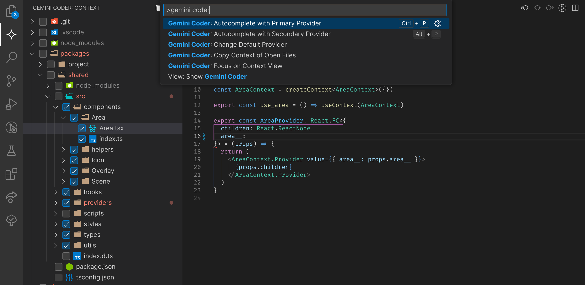

# Gemini Coder

## Description

Gemini Coder lets you use Gemini 2.0 for code completion (FIM) and file refactoring.

**You decide what is sent to the model.** With a dedicated Context Panel, you can granularly select the context attached to each completion/refactoring request.

The extension also bridges VS Code and AI Studio, giving you a unique way to comfortably chat about your code right from your favorite web browser.

Get browser integraion now:

- [Chrome](https://chromewebstore.google.com/detail/gemini-coder-connector/ljookipcanaglfaocjbgdicfbdhhjffp)
- [Firefox](https://addons.mozilla.org/en-US/firefox/addon/gemini-coder-connector/)

[]()

## Features

- Lightweight, 100% free, MIT licensed.
- Manually set context for all requests.
- Autocomplete at the cursor position.
- Chat about your code directly in AI Studio.
- Refactor the current file.
- Copy context, autocompletion, or file refactoring generated prompts to clipboard.
- Set up primary and secondary models for lightweight or specialized tasks.
- Provider agnostic, use any OpenAI API compatible provider or choose from many web chats (AI Studio, DeepSeek, and more).

## How to Use

1.  Open the Context View and select all relevant folders/files you want to attach as context in each completion request.
2.  Place the cursor where you want to insert code completion.
3.  Open the Command Palette (`Ctrl+Shift+P`).
4.  Run one of the following commands:
    - `Gemini Coder: Autocomplete with Primary Model`
    - `Gemini Coder: Autocomplete with Secondary Model`
    - `Gemini Coder: Refactor this file`
5.  You can also copy the prompt to the clipboard using:
    - `Gemini Coder: Copy Autocompletion Prompt to Clipboard`
    - `Gemini Coder: Copy File Refactoring Prompt to Clipboard`
6.  Change default models with command `Gemini Coder: Change Default Models`.
7.  Bind the commands to a key combination of your choice in `Preferences: Open Keyboard Shortcuts`, e.g., `Ctrl+P` for the Primary Model and `Alt+P` for the Secondary Model.
8.  Use the Chat panel to send custom instructions to the external chat (AI Studio, DeepSeek).

## Commands

- `Gemini Coder: Copy Context`: Copies the selected files' content to the clipboard.
- `Gemini Coder: Autocomplete with Primary Model`: Uses the primary model to autocomplete code at the cursor position.
- `Gemini Coder: Autocomplete with Secondary Model`: Uses the secondary model to autocomplete code at the cursor position.
- `Gemini Coder: Copy Autocompletion Prompt to Clipboard`: Copies the current autocompletion prompt to the clipboard.
- `Gemini Coder: Change Default Models`: Allows you to change the default primary and secondary models.
- `Gemini Coder: Refactor this file`: Refactors the current file based on the provided instruction.
- `Gemini Coder: Copy File Refactoring Prompt to Clipboard`: Copies the refactoring prompt to the clipboard.
- `Gemini Coder: Open Web Chat with Autocompletion Prompt`: Copies the current autocompletion prompt to the clipboard and opens the selected web chat.

## Set up custom providers

```json
  "geminiCoder.providers": [
    // Experimental Gemini
    {
      "name": "Gemini Flash 2.0 Exp",
      "endpointUrl": "https://generativelanguage.googleapis.com/v1beta/chat/completions",
      "bearerToken": "[API KEY]",
      "model": "gemini-2.0-flash-exp",
      "temperature": 0,
      "instruction": ""
    },
    {
      "name": "Gemini Exp 1206",
      "endpointUrl": "https://generativelanguage.googleapis.com/v1beta/chat/completions",
      "bearerToken": "[API KEY]",
      "model": "gemini-exp-1206",
      "temperature": 0,
      "instruction": ""
    },
    // Others
    {
      "name": "DeepSeek",
      "endpointUrl": "https://api.deepseek.com/v1/chat/completions",
      "bearerToken": "[API KEY]",
      "model": "deepseek-chat",
      "temperature": 0,
      "instruction": ""
    },
    {
      "name": "Mistral Large Latest",
      "endpointUrl": "https://api.mistral.ai/v1/chat/completions",
      "bearerToken": "[API KEY]",
      "model": "mistral-large-latest",
      "temperature": 0,
      "instruction": ""
    },
  ],
```

## License

MIT

This is not an official Google product.
